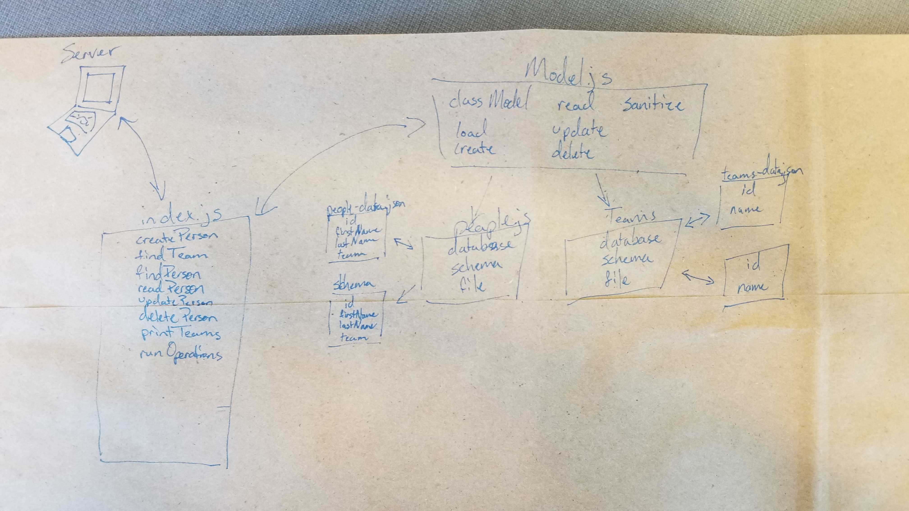

# lab04
# LAB - Data Modeling

### Author: Morgan Tatum Shaw

### Links and Resources
* [submission PR](https://github.com/morgan-401-advanced-javascript/lab04/pull/1)
* [travis](https://www.travis-ci.com/morgan-401-advanced-javascript/lab04)

#### Documentation
* [api docs](http://xyz.com) (API servers)
* [jsdoc](http://xyz.com) (Server assignments)

### Modules
#### `model.js`
#### `people.js`
#### `teams.js`
##### Exported Values and Methods
*createPerson
*findTeam
*findPerson
*readPerson
*updatePerson
*deletePerson
*printTeams
*runOperations

### Setup

#### Running the app
* `npm start`
* Endpoint: `/foo/bar/`
  * Returns a JSON object with abc in it.
* Endpoint: `/bing/zing/`
  * Returns a JSON object with xyz in it.
  
#### Tests
* How do you run tests? npm test
* What assertions were made?
* What assertions need to be / should be made?

#### UML
